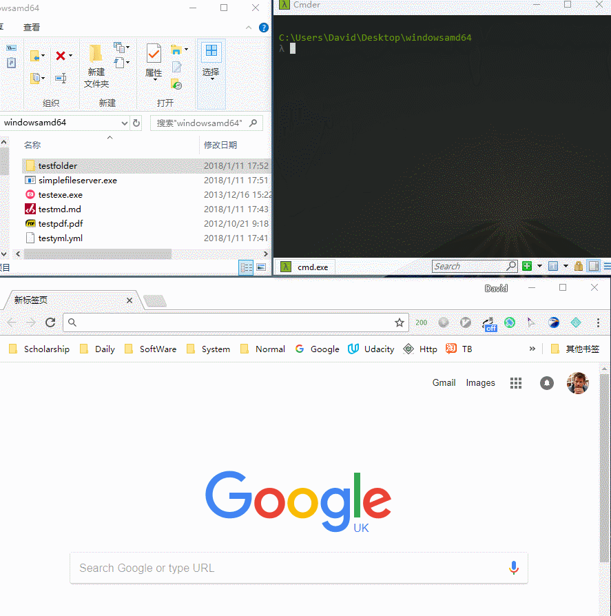

# Simple-file-server
Transfer and browse files as simple as possiable via HTTP. Supported Windows, Linux, Mac Os...

通过HTTP方式，简单的文件传输(下载)和浏览工具。目前支持Windows, Linux, Mac等操作系统。

# Preview

# Usage
1. Download the binary from the [release page](https://github.com/sssvip/simple-file-server/releases), choose your os relational edition
   
   
   国内加速便捷下载地址: [Windows](http://down.dxscx.com/simple-file-server_0.1.1_windows_amd64.tar.gz)        [Linux](http://down.dxscx.com/simple-file-server_0.1.1_linux_amd64.tar.gz)         [Mac](http://down.dxscx.com/simple-file-server_0.1.1_darwin_amd64.tar.gz) 

2. Put the binary to you want transfer or browse folder
    
    windonws: open cmd in this folder then ->

        > simplefileserver.exe 
        > 2018/01/11 16:52:53 starttd file server http://127.0.0.1:80
    
    linux: open terminal in this folder then->
    
        $ chmod 777 simplefileserver
        $ ./simplefileserver
        2018/01/11 16:52:53 starttd file server http://127.0.0.1:80
        
3. [Option] Custom file server port 
    
    a. open on port 80 (Default): 
        
        > simplefileserver.exe 80
        $ ./simplefileserver 80
    b. open on port 8080:
        
        > simplefileserver.exe 8080
        $ ./simplefileserver 8080
