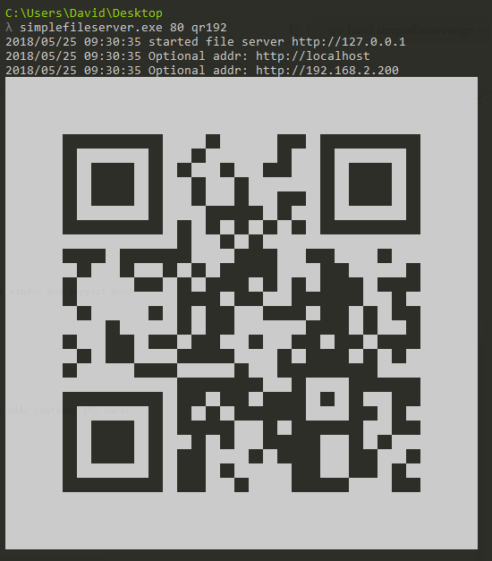

# Simple-file-server
Transfer and browse files as simple as possiable via HTTP. Supported Windows, Linux, Mac Os... (Support QRCode output,mobile phone get file more simply)

通过HTTP方式，简单的文件传输(下载)和浏览工具。目前支持Windows, Linux, Mac等操作系统。(支持输出二维码，方便手机直接扫码获取文件)

# Preview

# Fast Start
1. Linux
    
        $ wget http://down.dxscx.com/simple-file-server_current_linux_amd64.tar.gz
        $ tar -xzvf -xvsimple-file-server_current_linux_amd64.tar.gz
        $ chmod 777 simplefileserver
        $ sudo ./simplefileserver

2. Windows
        
        > http://down.dxscx.com/simplefileserver.exe         download it by your download tool
        > simplefileserver.exe 
        
        or 
        
        > put the binary simplefileserver.exe to you want share folder then double click.
       
        > 你可以将simplefileserver.exe放在你想分享文件的文件夹(例如放在桌面),直接双击simplefileserver.exe及可分享文件,
        
# Usage
1. Download the binary from the [release page](https://github.com/sssvip/simple-file-server/releases), choose your os relational edition
   
   
   国内加速便捷下载地址: [Windows](http://down.dxscx.com/simple-file-server_current_windows_amd64.tar.gz)        [Linux](http://down.dxscx.com/simple-file-server_current_linux_amd64.tar.gz)         [Mac](http://down.dxscx.com/simple-file-server_current_darwin_amd64.tar.gz) 

2. Put the binary to you want transfer or browse folder
    
    windonws: open cmd in this folder then ->

        > simplefileserver.exe 
        > 2018/01/11 16:52:53 starttd file server http://127.0.0.1:80
    
    linux: open terminal in this folder then->
    
        $ chmod 777 simplefileserver
        $ ./simplefileserver
        2018/01/11 16:52:53 starttd file server http://127.0.0.1:80
        
3. [Option] Custom file server port 
    
    a. open on port 80 (Default): 
        
        > simplefileserver.exe 80
        $ ./simplefileserver 80
    b. open on port 8080:
        
        > simplefileserver.exe 8080
        $ ./simplefileserver 8080

        
4. [New Feature] Show the url qrcode in the terminal. (Windows default window not support now)

    a. output all local ip addr qrcode:
    
        > simplefileserver.exe 80  qr
        $ ./simplefileserver 80 qr
        
    b. output local ip addr qrcode with filter key (eg: just output ip addr contains 192 once)
    
        > simplefileserver.exe 80 qr192
        $ ./simplefileserver 80 qr192     
        
      

# other

code need more readable, pull request, please.

代码为初学golang时编写,确实有很多可读性的优化,设计和使用也存在不规范,防止用户依赖原特性使用,保证兼容式更新,在不影响原功能输出情况下,欢迎pr.
